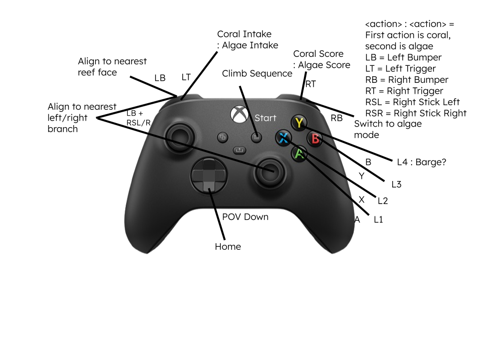

# Skip-5.15-Alpha
First code for the 2025 Reefscape robot

## Planned Controls

LB: Align to Nearest Reef Face

* Drivetrain faces to be perpendicular to nearest Reef face

RB: Game piece switch

* When held, setpoints are changed to the algae variant

LB + Right Joystick: Align to (Left/Right) Branch 

* Drivetrain faces to be perpendicular to nearest Reef face
* Drivetrain strafes to be in line with branch

LT: Intake

* Drivetrain faces nearest Coral Station
* Elevator comes down to STOW height, then arm moves to INTAKE state
* Once elevator and arm in position, coral rollers go to INTAKE state
* Once Lasercan in claw is triggered, switch to SHUFFLE state, then stop when target reached
* On end or release, arm moves back to STOW angle

LT + RB: Algae Intake

* Coral rollers go to ALGAE INTAKE

START: Climb sequence

* Elevator goes to STOW, Arm goes to CLIMB
* Climber goes to EXTEND
* Once start is pressed again, climber goes to CLIMB state

RT: Score

* When pressed, coral rollers go to SCORE state

RB + RT: Algae Score

* Coral rollers go to ALAGE SCORE state

A/X/B/Y: L1/L2/L3/L4 Branch

* Elevator goes to L# state
* Arm goes to L# state

A/X/B/Y + RB: Ground/L2/L3 Algae Ground intake or de-score

* Elevator goes to L#A state
* Arm goes to L#A state

Left Joystick: X/Y Field Centric drive
Right Joystick: Robot Relative Rotation

